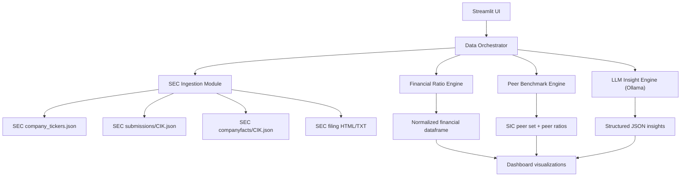

# AI Financial Statement Analyzer (Free-Only) - Comprehensive Build Guide

## 1) Project Goal
Build a web app where a user uploads or selects a company filing (10-K/10-Q), and the system:
- Extracts key narrative insights using an LLM
- Calculates core financial ratios from SEC XBRL facts
- Compares the company against an industry peer baseline
- Produces a concise investment-oriented summary

This guide is designed to keep the stack **completely free**.

---

## 2) Free-Only Constraint (Design Principle)
To keep the project free:
- Use **SEC EDGAR public data APIs** (no paid datasets)
- Use **local LLM inference via Ollama** (no paid LLM API)
- Use **Streamlit** for UI
- Use open-source Python libraries only
- Optional free hosting: Streamlit Community Cloud (subject to its free limits)

Important: The SEC requires fair access practices including identifying your app with a `User-Agent` and respecting rate limits.

---

## 3) Core Feature Scope

### MVP (Phase 1)
- Ticker input (example: `AAPL`)
- Fetch latest 10-K or 10-Q metadata from SEC submissions API
- Pull filing text (HTML/TXT), extract major sections
- Run local LLM extraction for:
  - Revenue trend commentary
  - Debt/risk commentary
  - Red flags
  - Management commentary highlights
- Pull XBRL company facts and compute ratios
- Show side-by-side: company ratios vs peer baseline
- Generate a short investment summary (not investment advice)

### V2 (Phase 2)
- PDF upload support and OCR fallback
- Multi-period trend charts (5Y annual, 8Q quarterly)
- Confidence scoring for extracted insights
- Export report (Markdown/PDF)
- Caching and background jobs for faster repeated runs

---

## 4) High-Level Architecture



---

## 5) Recommended Project Structure

```text
AI Financial Statement Analyzer/
  PROJECT_IMPLEMENTATION_GUIDE.md
  README.md
  requirements.txt
  .env.example
  app/
    main.py
    config.py
    ui/
      pages.py
      components.py
    services/
      sec_client.py
      filing_parser.py
      xbrl_mapper.py
      ratio_engine.py
      peer_engine.py
      llm_engine.py
      summary_engine.py
    models/
      schemas.py
    utils/
      caching.py
      logging.py
      text_clean.py
  data/
    raw/
    processed/
    cache/
  tests/
    test_ratio_engine.py
    test_filing_parser.py
    test_peer_engine.py
```

---

## 6) Environment Setup

## 6.1 Python + Virtual Env
```bash
cd "/Users/hyunjinyu/Projects/AI Financial Statement Analyzer"
python3 -m venv .venv
source .venv/bin/activate
pip install --upgrade pip
```

## 6.2 Requirements
Use a `requirements.txt` like:
```txt
streamlit
pandas
numpy
requests
beautifulsoup4
lxml
plotly
pydantic
python-dotenv
tenacity
ollama
pytest
```

Install:
```bash
pip install -r requirements.txt
```

## 6.3 Ollama (Local LLM)
1. Install Ollama from official docs.
2. Pull a model (example):
```bash
ollama pull llama3.1:8b
```
3. Confirm local API works:
```bash
curl http://localhost:11434/api/tags
```

---

## 7) SEC Data Acquisition Plan

## 7.1 Ticker -> CIK
Use SEC-provided ticker mapping JSON:
- `https://www.sec.gov/files/company_tickers.json`

Normalize CIK to 10 digits (left-pad zeros).

## 7.2 Filing Metadata (10-K / 10-Q list)
Use submissions endpoint:
- `https://data.sec.gov/submissions/CIK##########.json`

From `filings.recent`, filter by form in `{"10-K","10-Q"}` and select latest filing.

## 7.3 Filing Document URL
From submissions fields, combine:
- CIK (no leading zeros for archive path)
- accession number (remove dashes)
- primary document

Pattern:
- `https://www.sec.gov/Archives/edgar/data/{cik_no_leading_zeros}/{accession_no_dashes}/{primary_doc}`

## 7.4 XBRL Company Facts
Use:
- `https://data.sec.gov/api/xbrl/companyfacts/CIK##########.json`

Map key concepts (examples):
- `Revenues`
- `NetIncomeLoss`
- `Assets`
- `Liabilities`
- `StockholdersEquity`
- `AssetsCurrent`
- `LiabilitiesCurrent`
- `OperatingIncomeLoss`
- `InterestExpense`

Note: Concept availability varies by filer. Build fallback mappings.

## 7.5 SEC Fair Access Compliance
Always set headers:
- `User-Agent: YourName your@email.com`
- `Accept-Encoding: gzip, deflate`
- `Host: data.sec.gov`

Use a request throttle (for example: <= 5 requests/sec) and local caching.

---

## 8) Filing Parsing Strategy (10-K / 10-Q Text)

## 8.1 Parse Approach
1. Download filing HTML/TXT
2. Convert HTML to clean text with BeautifulSoup
3. Extract sections by Item headings (regex + heuristic windows)

Typical targets:
- 10-K: `Item 1`, `Item 1A (Risk Factors)`, `Item 7 (MD&A)`, `Item 7A`
- 10-Q: `Part I Item 2 (MD&A)`, `Part II Item 1A (Risk Factors)`

## 8.2 Section Extraction Heuristics
- Normalize whitespace and unicode artifacts
- Find all heading candidates with case-insensitive regex
- Choose segment boundaries based on next heading position
- Keep both raw and cleaned text for traceability

## 8.3 Quality Guardrails
- If section extraction confidence is low, fallback to full-text chunk scan
- Store source spans (start/end offsets) used for each extracted insight

---

## 9) LLM Insight Engine (Free Local)

## 9.1 Why Local LLM
- Zero API cost
- Keeps sensitive processing local
- Reproducible behavior with pinned model

## 9.2 Prompting Pattern
Use strict structured output (JSON schema-like instructions). Request fields:
- `revenue_trends`
- `debt_risk_signals`
- `risk_factor_highlights`
- `red_flags`
- `management_commentary`
- `evidence_quotes` (short snippets)
- `confidence` (0-1)

Rules in prompt:
- Use only provided filing text
- If unknown, return `"insufficient_evidence"`
- Keep each item concise
- Include section references (e.g., `Item 1A`, `Item 7`)

## 9.3 Chunking
- Chunk by semantic sections first (preferred)
- If long text remains, chunk to ~2,000-4,000 tokens equivalent
- Merge chunk-level outputs with a deterministic reducer

---

## 10) Financial Ratio Engine

Compute both company values and peer medians.

Core formulas:
- Current Ratio = `Current Assets / Current Liabilities`
- Debt-to-Equity = `Total Liabilities / Stockholders' Equity`
- Net Margin = `Net Income / Revenue`
- ROA = `Net Income / Total Assets`
- ROE = `Net Income / Stockholders' Equity`
- Operating Margin = `Operating Income / Revenue`
- Interest Coverage = `Operating Income / Interest Expense`

Implementation rules:
- Prefer annual (`10-K`) for stability, quarterly (`10-Q`) for recency view
- Handle negative denominators and near-zero divisions safely
- Return both numeric result and quality flag (`ok`, `missing_data`, `unstable_denominator`)

---

## 11) Industry Benchmark Engine (Free)

## 11.1 Peer Definition
Use SEC SIC-based peers:
1. Get target company SIC from submissions JSON
2. Build a local universe file of companies + SIC
3. Select peers with same SIC (optionally same market-cap bucket if available later)

## 11.2 Free Peer Data Build
Option A (recommended): use SEC bulk submissions dataset and cache locally.
- SEC bulk submissions include `submissions.zip` on EDGAR bulk data.
- Build a local table: `cik, ticker, company_name, sic, sic_description`

## 11.3 Peer Ratio Aggregation
For each peer sample (e.g., top 20-50 peers):
- Pull companyfacts
- Compute same ratios using same formula rules
- Aggregate benchmark with median and interquartile range (IQR)

Output:
- Company ratio
- Peer median
- Percentile or z-score style positioning

---

## 12) Streamlit App Design

Pages:
1. **Analyzer**
- Inputs: ticker, form type (`10-K`/`10-Q`), fiscal period
- Buttons: `Fetch Filing`, `Run Analysis`
- Outputs: KPI cards, trend charts, extracted insights, summary

2. **Peer Benchmark**
- Peer group size control
- Ratio comparison table
- Distribution chart (box/violin)

3. **Diagnostics**
- API call logs
- Missing concept warnings
- Extraction confidence and fallback flags

UX notes:
- Use `st.cache_data` for SEC responses and parsed artifacts
- Show loading/progress state for long operations
- Offer "download report" as Markdown

---

## 13) Suggested Build Plan (Execution Order)

## Sprint 0: Skeleton (Day 1)
- Create folders, config, logging, schemas
- Add SEC client with compliant headers and retry logic
- Add one Streamlit page shell

## Sprint 1: Data Pipeline (Days 2-3)
- Ticker->CIK mapping
- Latest 10-K/10-Q metadata fetch
- Filing text fetch + parse + section extraction
- Unit tests for parsing edge cases

## Sprint 2: Ratio Engine (Days 4-5)
- XBRL concept mapping with fallback list
- Ratio calculations + data quality flags
- Plotly trend visuals

## Sprint 3: LLM Insights (Days 6-7)
- Ollama integration with structured extraction
- Section-wise extraction + merge
- Confidence scoring and evidence linking

## Sprint 4: Peer Benchmark + Summary (Days 8-10)
- SIC peer universe cache
- Peer ratio aggregation
- Investment summary generator (facts + insights + benchmark)

## Sprint 5: Hardening (Days 11-12)
- Error handling
- Test coverage improvement
- Final report export
- Documentation and demo script

---

## 14) Testing Strategy

Unit tests:
- Ratio formula correctness
- Missing data behavior
- Section extraction boundaries

Integration tests:
- End-to-end on 2-3 known tickers
- Confirm each output section is generated

Regression tests:
- Store sample filings and expected outputs snapshot
- Validate no schema drift in LLM JSON output

Performance checks:
- Cold run vs cached run time
- API call counts per analysis

---

## 15) Risk Register + Mitigations

1. Filing structure inconsistency
- Mitigation: regex + heuristic fallback + confidence score

2. Missing XBRL concepts
- Mitigation: concept fallback map and ratio quality flags

3. LLM hallucination
- Mitigation: extraction constrained to provided text + evidence quotes

4. SEC rate limits/timeouts
- Mitigation: retries, backoff, caching, request throttling

5. Peer baseline noise (small sample)
- Mitigation: minimum peer count threshold + display sample size

---

## 16) Minimal Starter TODO Checklist

- [ ] Initialize repo and virtual env
- [ ] Create `requirements.txt`
- [ ] Implement `sec_client.py` with headers/retries/throttle
- [ ] Implement ticker->CIK lookup
- [ ] Implement filings fetch and filing URL builder
- [ ] Implement parser and section extraction
- [ ] Implement companyfacts loader + concept mapping
- [ ] Implement ratio engine with tests
- [ ] Integrate Ollama extraction
- [ ] Build Streamlit analyzer page
- [ ] Build peer benchmark module
- [ ] Generate final summary block
- [ ] Add caching + diagnostics
- [ ] Final polish and README demo steps

---

## 17) Suggested README Sections

- Project overview
- Features
- Architecture
- Setup and run
- Example workflow
- Data sources and compliance
- Limitations and disclaimer
- Future roadmap

---

## 18) Compliance, Ethics, and Disclaimer

- This tool is for educational/research analysis and is **not investment advice**.
- Always show data provenance (filing date, form type, section references).
- Keep extracted evidence visible to users for interpretability.

---

## 19) Free Deployment Options

1. Local only (recommended initially)
- Zero hosting cost
- Fast iteration

2. Streamlit Community Cloud
- Free tier available; review current resource limits before production usage
- May not support heavy local-model inference directly

Practical deployment pattern:
- Keep LLM inference local during development
- Deploy UI and lightweight analytics first
- Add remote inference only if needed later

---

## 20) Source References (Primary)

- SEC EDGAR API + fair access + endpoint patterns:
  - https://www.sec.gov/search-filings/edgar-application-programming-interfaces
- SEC ticker mapping file:
  - https://www.sec.gov/files/company_tickers.json
- SEC submissions endpoint pattern:
  - https://data.sec.gov/submissions/CIK##########.json
- SEC XBRL companyfacts endpoint pattern:
  - https://data.sec.gov/api/xbrl/companyfacts/CIK##########.json
- SEC filing forms and disclosures (10-K/10-Q overview):
  - https://www.sec.gov/about/forms/form10-k.pdf
  - https://www.investor.gov/introduction-investing/general-resources/news-alerts/alerts-bulletins/investor-bulletins/how-read
- Ollama API docs:
  - https://github.com/ollama/ollama/blob/main/docs/api.md
- Streamlit file uploader docs:
  - https://docs.streamlit.io/develop/api-reference/widgets/st.file_uploader
- Streamlit deployment docs:
  - https://docs.streamlit.io/deploy/streamlit-community-cloud/manage-your-app

---

## 21) Next Concrete Commands to Start

```bash
cd "/Users/hyunjinyu/Projects/AI Financial Statement Analyzer"
python3 -m venv .venv
source .venv/bin/activate
cat > requirements.txt << 'REQ'
streamlit
pandas
numpy
requests
beautifulsoup4
lxml
plotly
pydantic
python-dotenv
tenacity
ollama
pytest
REQ
pip install -r requirements.txt
```

Then create the first app shell:
```bash
mkdir -p app/{ui,services,models,utils} tests data/{raw,processed,cache}
touch app/main.py app/config.py
streamlit run app/main.py
```

